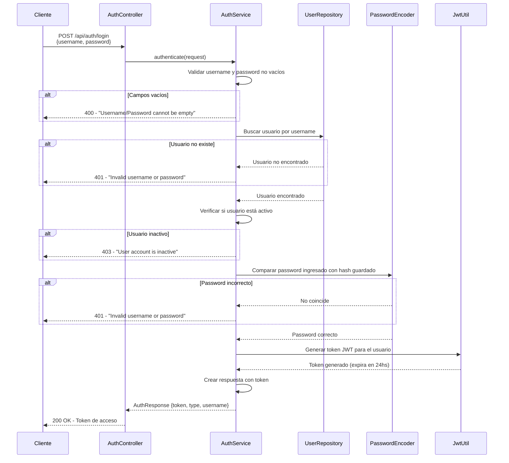

# Diagrama de Secuencia: Autenticación de Usuario (Login)

Este diagrama muestra el flujo de autenticación de un usuario en el sistema.



## Descripción del Flujo

1. **Cliente envía credenciales**: POST a `/api/auth/login` con username y password
2. **Validación básica**: Se verifica que los campos no estén vacíos
3. **Búsqueda de usuario**: Se busca en la base de datos por username
4. **Verificación de estado**: Se confirma que el usuario esté activo
5. **Validación de password**: Se compara el password con bcrypt hash
6. **Generación de token**: Se crea un JWT válido por 24 horas
7. **Respuesta exitosa**: Se devuelve el token al cliente

## Request/Response

**Request:**
```json
{
  "username": "store1",
  "password": "password123"
}
```

**Response exitosa (200):**
```json
{
  "token": "eyJhbGciOiJIUzI1NiJ9...",
  "type": "Bearer",
  "username": "store1"
}
```

## Errores Posibles

| Código | Descripción |
|--------|-------------|
| 400 | Username o password vacío |
| 401 | Credenciales incorrectas |
| 403 | Cuenta de usuario inactiva |
| 500 | Error al generar token |
