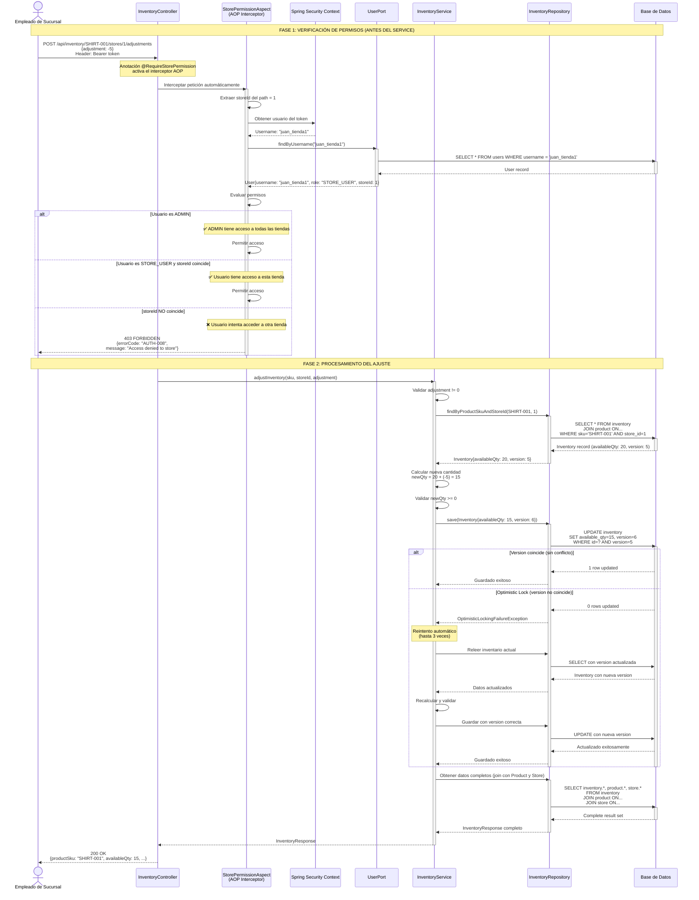

# Diagrama de Secuencia: Ajuste Incremental de Stock (Adjustment)

Este diagrama muestra cómo un empleado de sucursal ajusta el stock (suma o resta) de un producto.

## ¿Qué es la Verificación de Permisos?

Es un sistema de seguridad basado en **AOP (Aspect-Oriented Programming)** que intercepta automáticamente las peticiones antes de ejecutar el ajuste de stock.

**Reglas:**
- **Usuarios ADMIN**: Pueden ajustar el stock de CUALQUIER tienda
- **Usuarios STORE_USER**: Solo pueden ajustar el stock de la tienda que tienen asignada
- **Validación automática**: Se verifica comparando el `storeId` del request con el `storeId` asignado al usuario en la BD

**Ejemplo:**
- Usuario "juan_tienda1" (asignado a tienda 1) → Solo puede ajustar stock de tienda 1
- Usuario "admin" (rol ADMIN) → Puede ajustar stock de cualquier tienda



## Descripción del Flujo

### FASE 1: Verificación de Permisos (Automática vía AOP)
1. **Interceptor se activa**: El `@RequireStorePermission` dispara el `StorePermissionAspect`
2. **Extrae storeId**: Del path del request (`/stores/1/`)
3. **Obtiene usuario**: Del token JWT en el header
4. **Consulta BD**: Busca el usuario y su rol/tienda asignada
5. **Evalúa reglas**:
   - Si es ADMIN → ✅ Permitir
   - Si es STORE_USER → Comparar `storeId` del request vs `storeId` del usuario
6. **Bloquea o permite**: Si no coincide, devuelve 403 y NO continúa

### FASE 2: Procesamiento del Ajuste (Solo si pasó la fase 1)
7. **Validaciones de negocio**: Ajuste != 0, inventario existe
8. **Cálculo**: Nueva cantidad = actual + ajuste
9. **Validación de stock**: No puede quedar negativo
10. **Guardado con Optimistic Locking**: Manejo de concurrencia
11. **Respuesta**: Inventario actualizado

## Request/Response

**Request (venta de 5 unidades):**
```json
POST /api/inventory/SHIRT-001/stores/1/adjustments
{
  "adjustment": -5
}
```

**Request (recepción de 10 unidades):**
```json
{
  "adjustment": 10
}
```

**Response exitosa (200):**
```json
{
  "productSku": "SHIRT-001",
  "productName": "Camisa Azul",
  "storeId": 1,
  "storeName": "Tienda Centro",
  "availableQty": 15,
  "version": 6,
  "updatedAt": "2025-10-07T15:45:30"
}
```

## Errores Posibles

| Código | Descripción |
|--------|-------------|
| 400 | Adjustment = 0 o stock resultante negativo |
| 403 | Usuario sin permiso para esa tienda |
| 404 | Inventario no existe |
| 409 | Error de concurrencia (múltiples ajustes simultáneos) |

## Casos de Uso

- **Venta**: `adjustment: -5` (reduce stock)
- **Recepción de mercadería**: `adjustment: 20` (aumenta stock)
- **Devolución**: `adjustment: 2` (aumenta stock)
- **Merma/Robo**: `adjustment: -3` (reduce stock)

## Nota sobre Concurrencia

Si dos empleados ajustan el stock al mismo tiempo, el sistema:
1. Detecta el conflicto automáticamente (campo `version`)
2. Reintenta hasta 3 veces con los valores actualizados
3. Garantiza que ambos ajustes se apliquen correctamente
