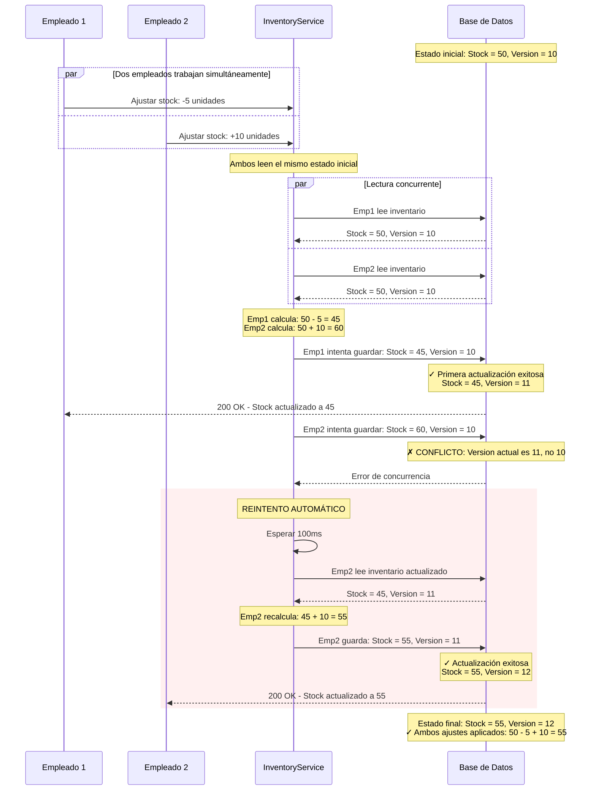

# Diagrama de Secuencia: Manejo de Concurrencia (Optimistic Locking)

Este diagrama muestra cómo el sistema maneja cuando dos empleados intentan modificar el mismo inventario al mismo tiempo.



## Descripción del Flujo

1. **Dos empleados simultáneamente**: Uno vende 5 unidades, otro recibe 10 unidades
2. **Lectura inicial**: Ambos leen el mismo estado (Stock = 50)
3. **Primera escritura exitosa**: Empleado 1 actualiza a 45 (Version pasa a 11)
4. **Detección de conflicto**: Empleado 2 intenta guardar pero la versión ya cambió
5. **Reintento automático**: El sistema reintenta con los valores actualizados
6. **Segunda escritura exitosa**: Empleado 2 actualiza correctamente a 55
7. **Resultado correcto**: Ambas operaciones se aplican sin perder ninguna

## Cómo Funciona el Control de Versiones

### Campo Version en la Base de Datos
```java
@Entity
public class Inventory {
    private Long id;
    private Integer availableQty;
    
    @Version  // Este campo controla la concurrencia
    private Integer version;
}
```

### Query de Actualización
```sql
UPDATE inventory 
SET available_qty = ?, 
    version = version + 1
WHERE id = ? 
  AND version = ?  -- Solo actualiza si la versión coincide
```

### Lógica de Detección
- Si la versión coincide → Actualización exitosa
- Si la versión NO coincide → Otra persona modificó primero → Reintentar

## Configuración de Reintentos

- **Número de reintentos**: 3 intentos máximo
- **Tiempo de espera**: 100ms, luego 200ms, luego 400ms (backoff exponencial)
- **Qué hacer si fallan todos**: Devolver error 409 Conflict

## Ventajas de este Enfoque

✅ **No bloquea la base de datos**: Múltiples empleados pueden leer simultáneamente  
✅ **Detección automática de conflictos**: Usa el campo `version` como control  
✅ **Resolución automática**: La mayoría de conflictos se resuelven con reintentos  
✅ **Sin pérdida de datos**: Ambas operaciones siempre se aplican correctamente  
✅ **Escalable**: Funciona con múltiples servidores y sucursales  

## Casos de Uso Reales

- **Caja simultánea**: Dos cajeros venden el mismo producto al mismo tiempo
- **Venta + Recepción**: Un empleado vende mientras otro recibe mercadería
- **Múltiples tiendas**: El sistema puede tener varias instancias corriendo en paralelo
