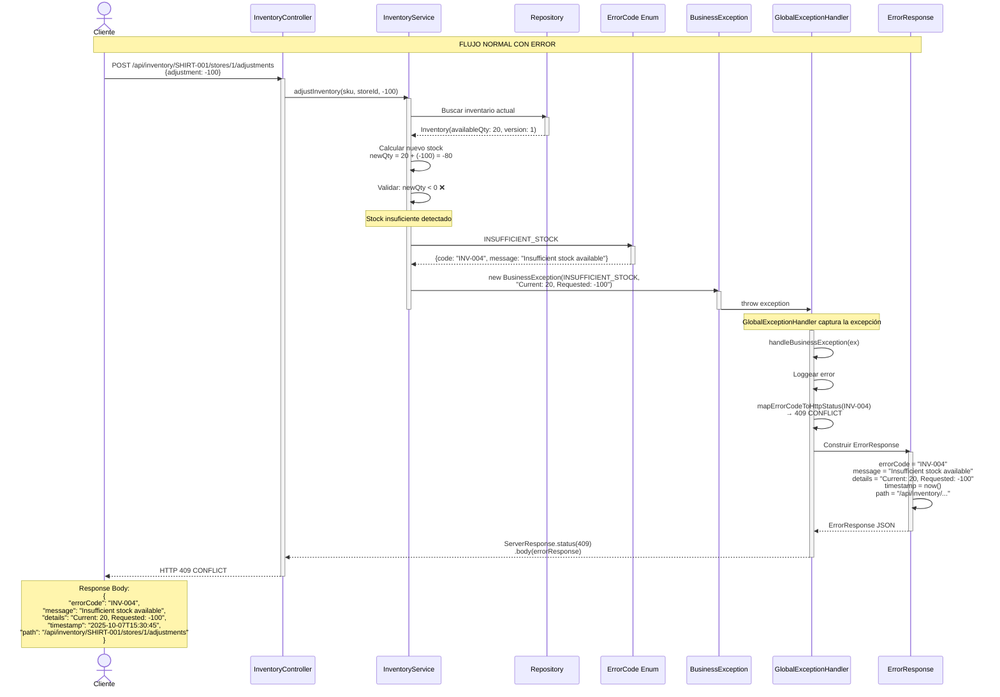
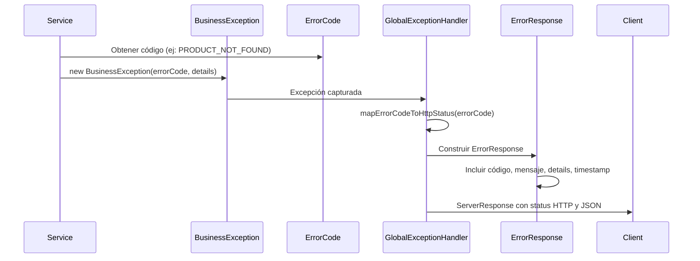

# Diagrama de Secuencia: Manejo de Errores y Excepciones

Este diagrama muestra cómo el sistema maneja diferentes tipos de errores usando excepciones personalizadas.

## Componentes del Sistema de Errores

### 1. ErrorCode (Enum)
Define todos los códigos de error estandarizados del sistema:
- **INV-XXX**: Errores de inventario
- **AUTH-XXX**: Errores de autenticación/autorización
- **VAL-XXX**: Errores de validación
- **SYS-XXX**: Errores del sistema

### 2. BusinessException
Excepción personalizada que contiene:
- `ErrorCode`: El código de error
- `details`: Detalles adicionales específicos del error
- `message`: Mensaje predefinido del ErrorCode

### 3. GlobalExceptionHandler
Intercepta todas las excepciones y las convierte en respuestas HTTP apropiadas.

---

## Diagrama de Secuencia: Flujo Completo de Manejo de Errores

Este diagrama muestra un ejemplo completo de cómo se maneja un error en el sistema, desde que se lanza la excepción hasta que el cliente recibe la respuesta.

**Ejemplo**: Un usuario intenta reducir stock de un producto, pero no hay suficiente cantidad disponible.



---

## Explicación del Flujo

### 1️⃣ **Request del Cliente**
El cliente envía una petición para ajustar el stock (reducir 100 unidades).

### 2️⃣ **Procesamiento en el Service**
- El service busca el inventario actual en la base de datos
- Encuentra que solo hay 20 unidades disponibles
- Calcula: 20 + (-100) = -80 (resultado negativo ❌)
- Detecta que es una operación inválida

### 3️⃣ **Creación de la Excepción**
- El service consulta el `ErrorCode.INSUFFICIENT_STOCK`
- Crea una nueva `BusinessException` con:
  - El ErrorCode correspondiente
  - Detalles específicos del error (stock actual vs solicitado)

### 4️⃣ **Captura en GlobalExceptionHandler**
- El handler intercepta automáticamente la excepción
- Identifica que es una `BusinessException`
- Registra el error en los logs

### 5️⃣ **Mapeo a HTTP Status**
- Convierte el ErrorCode a un código HTTP apropiado
- `INV-004` → `409 CONFLICT`

### 6️⃣ **Construcción de ErrorResponse**
- Crea un objeto JSON estandarizado con:
  - Código de error
  - Mensaje predefinido
  - Detalles específicos
  - Timestamp
  - Path de la petición

### 7️⃣ **Respuesta al Cliente**
- Devuelve un HTTP 409 con el JSON de error
- El cliente recibe información clara y estructurada del problema

---

## Tabla de Códigos de Error

### Errores de Inventario (INV)

| Código | Error | HTTP Status | Cuándo ocurre |
|--------|-------|-------------|---------------|
| INV-001 | PRODUCT_NOT_FOUND | 404 | SKU no existe en la base de datos |
| INV-002 | STORE_NOT_FOUND | 404 | ID de tienda no existe |
| INV-003 | INVENTORY_NOT_FOUND | 404 | No hay inventario para ese producto/tienda |
| INV-004 | INSUFFICIENT_STOCK | 409 | Intentar reducir stock más de lo disponible |
| INV-005 | NEGATIVE_QUANTITY_NOT_ALLOWED | 400 | Cantidad negativa en campo que no lo permite |
| INV-006 | OPTIMISTIC_LOCK_FAILURE | 409 | Modificación concurrente detectada |
| INV-009 | INVALID_ADJUSTMENT | 400 | Ajuste = 0 o formato inválido |

### Errores de Autenticación (AUTH)

| Código | Error | HTTP Status | Cuándo ocurre |
|--------|-------|-------------|---------------|
| AUTH-005 | INVALID_CREDENTIALS | 401 | Usuario/contraseña incorrectos |
| AUTH-006 | USER_NOT_FOUND | 404 | Usuario no existe |
| AUTH-007 | USER_NOT_AUTHENTICATED | 403 | Sin token o token inválido |
| AUTH-008 | ACCESS_DENIED_TO_STORE | 403 | Empleado intenta acceder a otra tienda |
| AUTH-009 | ADMIN_ACCESS_REQUIRED | 403 | Operación requiere rol ADMIN |
| AUTH-013 | USER_ACCOUNT_INACTIVE | 403 | Cuenta de usuario desactivada |

### Errores de Validación (VAL)

| Código | Error | HTTP Status | Cuándo ocurre |
|--------|-------|-------------|---------------|
| VAL-001 | VALIDATION_ERROR | 400 | Campos con valores inválidos |
| VAL-004 | INVALID_PARAMETER_FORMAT | 400 | Formato de parámetro incorrecto |

### Errores del Sistema (SYS)

| Código | Error | HTTP Status | Cuándo ocurre |
|--------|-------|-------------|---------------|
| SYS-001 | INTERNAL_SERVER_ERROR | 500 | Error inesperado del servidor |
| SYS-002 | DATABASE_ERROR | 500 | Error de base de datos |

---

## Formato de Respuesta de Error

### Respuesta estándar:
```json
{
  "errorCode": "INV-001",
  "message": "Product not found",
  "details": "Product with SKU SHIRT-999 not found",
  "timestamp": "2025-10-07T15:30:45",
  "path": "/api/inventory/SHIRT-999/stores/1"
}
```

### Respuesta con errores de validación:
```json
{
  "errorCode": "VAL-001",
  "message": "Validation error",
  "timestamp": "2025-10-07T15:30:45",
  "path": "/api/inventory/SHIRT-001/stores/1",
  "validationErrors": [
    {
      "field": "availableQty",
      "message": "must be greater than or equal to 0"
    },
    {
      "field": "sku",
      "message": "must not be blank"
    }
  ]
}
```

---

## Flujo de Manejo de Excepciones



---

## Ejemplos de Uso en el Código

### 1. Lanzar excepción cuando producto no existe:
```java
// En el Service
Product product = productRepository.findBySku(sku)
    .orElseThrow(() -> new BusinessException(
        ErrorCode.PRODUCT_NOT_FOUND,
        String.format("Product with SKU %s not found", sku)
    ));
```

### 2. Validar stock insuficiente:
```java
// En el Service
if (newQuantity < 0) {
    throw new BusinessException(
        ErrorCode.INSUFFICIENT_STOCK,
        String.format("Current: %d, Adjustment: %d", currentStock, adjustment)
    );
}
```

### 3. El handler convierte automáticamente:
```java
// En GlobalExceptionHandler
private Mono<ServerResponse> handleBusinessException(BusinessException ex, ServerRequest request) {
    ErrorResponse errorResponse = ErrorResponse.builder()
        .errorCode(ex.getErrorCode().getCode())      // "INV-001"
        .message(ex.getErrorCode().getMessage())      // "Product not found"
        .details(ex.getDetails())                     // "Product with SKU..."
        .timestamp(LocalDateTime.now())
        .path(request.path())
        .build();
    
    HttpStatus status = mapErrorCodeToHttpStatus(ex.getErrorCode()); // 404
    return ServerResponse.status(status)
        .body(BodyInserters.fromValue(errorResponse));
}
```

---

## Ventajas del Sistema de Errores Personalizado

✅ **Códigos estandarizados**: Todos los errores tienen un código único (INV-001, AUTH-005, etc.)  
✅ **Mensajes consistentes**: Definidos en el enum ErrorCode  
✅ **Detalles contextuales**: Cada excepción puede incluir información específica  
✅ **Mapeo automático**: El handler convierte ErrorCode → HTTP Status  
✅ **Logging centralizado**: Todos los errores se registran en un solo lugar  
✅ **Respuestas uniformes**: Mismo formato JSON para todos los errores  
✅ **Fácil mantenimiento**: Agregar un nuevo error solo requiere actualizar ErrorCode
